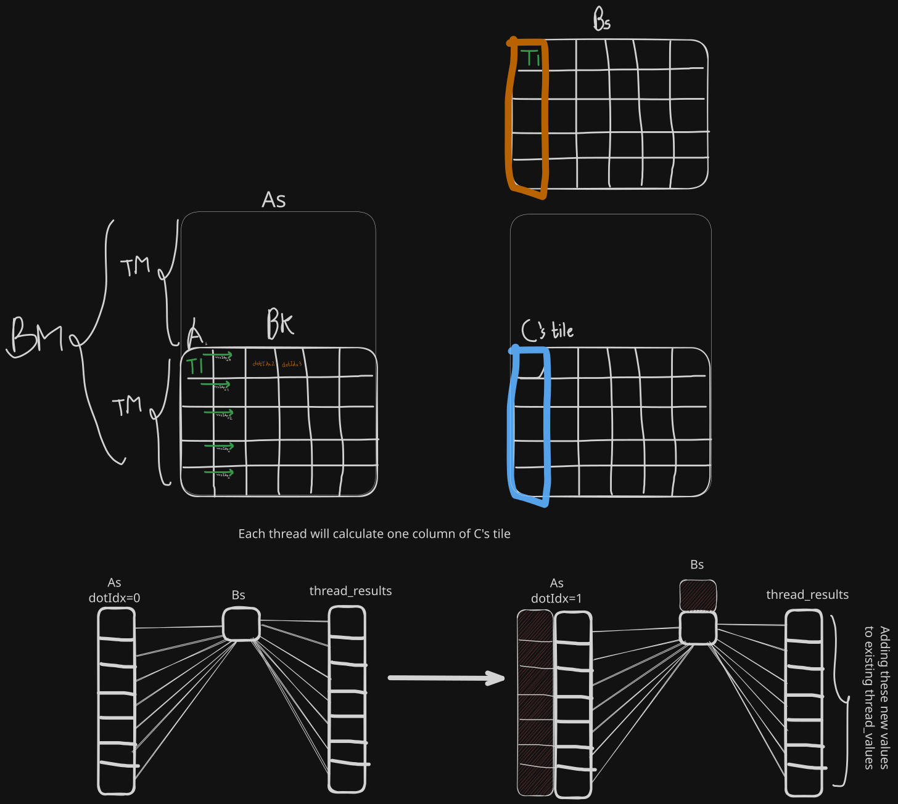

[Blog's description](https://siboehm.com/articles/22/CUDA-MMM#:~:text=Kernel%204%3A%201D%20Blocktiling%20for%20Calculating%20Multiple%20Results%20per%20Thread)  
My diagram to explain inner loop and calculations.
```cpp
    for (uint dotIdx = 0; dotIdx < BK; dotIdx++) {
      float Btmp = Bs[dotIdx * BN + threadCol];
      for (uint resIdx = 0; resIdx < TM; resIdx++) {
        threadResults[resIdx] +=
            As[(threadRow * TM + resIdx) * BK + dotIdx] * Btmp;
      }
    }

```

Once `thread index.x` has been converted to rows and columns using `thread index.x / some dimension` and `thread index.x % some dimension`, then you should stop worrying about global memory coalescing (as it has been already handled here) and start thinking of the entire problem in terms of thread rows and thread columns. 
